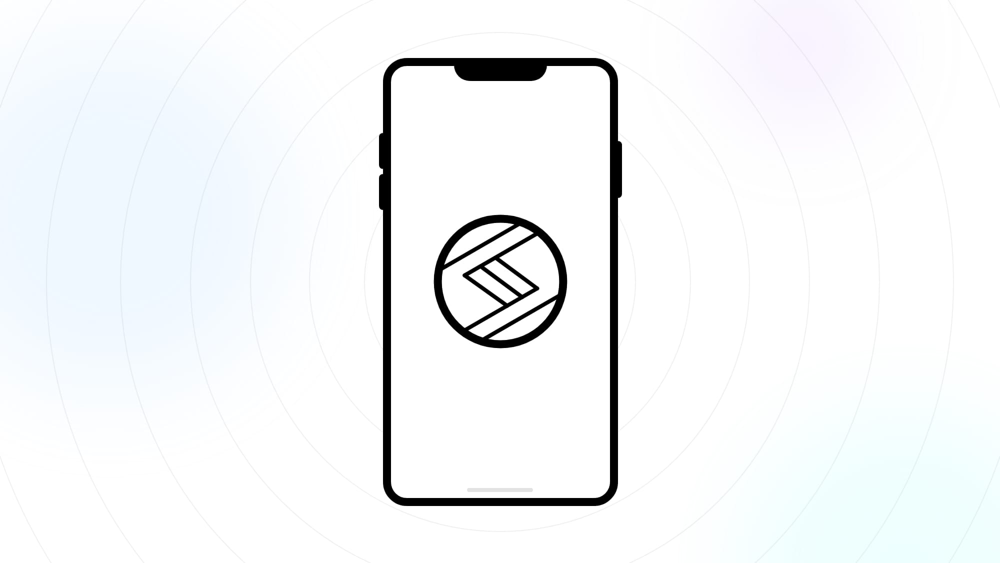

<p align='center'>
  
<p/>

<div align="center" >
  <h1>
    Stitches Native
  </h1>
  &middot;
  <i>React Native implementation of the popular CSS-in-JS library Stitches</i>
  &middot;
  <br/>
  <br/>
</div>

## Installation

> ⚠️ NOTE: This library is still under development and there only exists a canary release on npm.

```sh
npm install stitches-native@canary
```

or if you use `yarn`:

```sh
yarn add stitches-native@canary
```

## Documentation

For the most part Stitches Native behaves exactly as Stitches so you should follow the [Stitches documentation](https://stitches.dev/) to learn the basic principles and how to setup everything.

## Differences

Due to the inherit differences between the Web and native platforms (iOS + Android) the implementation of Stitches Native differs slightly from the original Web version of Stitches.

First of all, CSS in React Native doesn't have CSS Variables, cascade, inheritance, keyframes, pseudo elements/classes, or global styles which means that some features that are available in Stitches are not possible to implement in Stitches Native.

Below you can see a list of all supported and unsupported features of Stitches Native.

### Feature comparison

| Feature               | Supported                                |
| --------------------- | ---------------------------------------- |
| `styled`              | ✅ (with additional `.attrs` support)    |
| `createStitches`      | ✅                                       |
| `defaultThemeMap`     | ✅                                       |
| `css`                 | ✅ _(Simplified version)_                |
| `theme`               | ✅                                       |
| `createTheme`         | ✅ _(Only returned by `createStitches`)_ |
| `globalCss`           | ❌ _(No global styles in RN)_            |
| `keyframes`           | ❌ _(No CSS keyframes in RN)_            |
| `getCssText`          | ❌ _(SSR not applicable to RN)_          |
| Nesting               | ❌ _(No CSS cascade in RN)_              |
| Selectors             | ❌ _(No CSS selectors in RN)_            |
| Locally scoped tokens | ❌ _(No CSS variables in RN)_            |
| Pseudo elements       | ❌ _(No pseudo elements/classes in RN)_  |

### Using `createStitches` function

The `createStitches` function doesn't need `prefix` or `insertionMethod` since they are not used in the native implementation.

```js
import { createStitches } from 'stitches-native';

createStitches({
  theme: object,
  media: object,
  utils: object,
  themeMap: object,
});
```

The return value of `createStitches` doesn't include `globalCss`, `keyframes`, or `getCssText` since they are not available in native platforms. React Native doesn't have any CSS keyframes based animations and all animations should be handled by the [Animated API](https://reactnative.dev/docs/animated) or with libraries such as [react-native-reanimated](https://github.com/software-mansion/react-native-reanimated).

The return value of `createStitches` consist of the following:

```js
const { styled, css, theme, createTheme, useTheme, ThemeProvider, config } =
  createStitches({
    /*...*/
  });
```

#### Supported token types

The following token types are supported in React Native: `borderStyles`, `borderWidths`, `colors`, `fonts`, `fontSizes`, `fontWeights`, `letterSpacings`, `lineHeights`, `radii`, `sizes`, `space`, `zIndices`.

The only unsupported token types are `shadows` and `transitions`. Shadows in React Native cannot be expressed with a single string token like on the Web where CSS `box-shadow` accepts a string that fully describes the shadow. In React Native shadows are defined differently on iOS and Android. On [iOS](https://reactnative.dev/docs/shadow-props) you need to set the various shadow properties separately:

```ts
shadowOffset: {
  width: number,
  height: number
},
shadowOpacity: number,
shadowRadius: number
```

On [Android](https://developer.android.com/training/material/shadows-clipping#Elevation) there is a completely different elevation system that doesn't let you alter individual shadow properties but instead you have to set a single number as the elevation level:

```ts
elevation: number;
```

So, instead of having shadows as part of the design tokens in the `theme` we can quite easily define shadow utilities inside `utils`:

```js
createStitches({
  utils: {
    shadow: (level: 'small' | 'medium' | 'large') => {
      return {
        small: {
          elevation: 2,
          shadowOffset: { width: 0, height: 1 },
          shadowRadius: 3,
          shadowOpacity: 0.1,
          shadowColor: '#000',
        },
        medium: {
          elevation: 5,
          shadowOffset: { width: 0, height: 3 },
          shadowRadius: 6,
          shadowOpacity: 0.2,
          shadowColor: '#000',
        },
        large: {
          elevation: 10,
          shadowOffset: { width: 0, height: 6 },
          shadowRadius: 12,
          shadowOpacity: 0.4,
          shadowColor: '#000',
        },
      }[level];
    },
  },
});
```

You can then use the shadow util like this:

```js
const Comp = styled('View', {
  shadow: 'medium',
});
```

The other unsupported token type is `transitions` which conflicts with how animations are handled in React Native. Read more about animations in the [Animations docs](https://reactnative.dev/docs/animations).

### Using `css` helper

Unlike on the Web there is no concept of `className` in React Native so the `css` function is basically an identity function providing only TS types for the style object and returning exactly the same object back (or if given multiple objects merges them together). The returned object can be appended after the first argument of a styled component.

```jsx
const styles = css({
  backgroundColor: '$background', // <- get autocomplete for theme values
});

const SomeComp = styled(
  'View',
  {
    /* ...other styles... */
  },
  styles // <- you can add as many shared styles as you want
);

<AnotherComp css={styles} />;
```

### Theming with `createTheme`

Stitches Native handles theming differently than Stitches. Since there are no CSS Variables in React Native theming is handled via React Context in a similar way as other CSS-in-JS libraries such as [styled-components](https://styled-components.com/docs/advanced#theming) handle theming.

```tsx
const { theme, createTheme, ThemeProvider } = createStitches({
  colors: {
    background: '#fff',
    text: '#000',
  },
});

const darkTheme = createTheme({
  colors: {
    background: '#000',
    text: '#fff',
  },
});

function App() {
  // In a real world scenario this value should probably live in React Context
  const [darkMode, setDarkMode] = useState(false);

  return (
    <ThemeProvider theme={darkMode ? darkTheme : theme}>
      {/*...*/}
    </ThemeProvider>
  );
}
```

### Responsive styles with `media`

Responsive styles are not very common in React Native applications since you usually have a clearly constrained device environment where the app is used. However, some times you might need to tweak a style for very small or large phones or build an app that needs to adapt to tablet devices. For these use cases Stitches Native has support for two kinds of responsive styles:

1. Device types based media flags
2. Device dimensions based media queries

#### Device types based media flags

Simple boolean flags in the `media` config can be used to distinguish between device types, eg. phone vs. tablet. You can utilize [`getDeviceType()`](https://github.com/react-native-device-info/react-native-device-info#getDeviceType) or [`isTablet()`](https://github.com/react-native-device-info/react-native-device-info#istablet) from [react-native-device-info](https://github.com/react-native-device-info/react-native-device-info) to get the device type.

```js
const isTablet = DeviceInfo.isTablet();

const { ... } = createStitches({
  media: {
    phone: !isTablet,
    tablet: isTablet,
  },
});
```

Then you can apply different prop values for variants of a styled components based on the device type:

```tsx
const ButtonText = styled('Text', {
  // base styles

  variants: {
    color: {
      primary: {
        color: '$primary',
      },
      secondary: {
        color: '$secondary',
      },
    },
  },
});

<ButtonText color={{ '@phone': 'primary', '@tablet': 'secondary' }}>
  Hello
</ButtonText>;
```

#### Device dimensions based media queries

It's also possible to have a more Web-like breakpoint system based on the dimensions of the device. The syntax for the queries follows the CSS [range queries](https://developer.mozilla.org/en-US/docs/Web/CSS/Media_Queries/Using_media_queries#syntax_improvements_in_level_4) syntax which means that there is no need to use `min-width` or `max-width`.

Examples of supported range queries:

- `(width > 750px)`
- `(width >= 750px)`
- `(width < 1080px)`
- `(width <= 1080px)`
- `(750px > width >= 1080px)`

> ⚠️ NOTE: Only width based media queries are currently supported.

```js
const { ... } = createStitches({
  media: {
    md: '(width >= 750px)',
    lg: '(width >= 1080px)',
    xl: '(width >= 1284px)',
    xxl: '(width >= 1536px)',
  },
});
```

> ⚠️ NOTE: The order of the media query keys matters and the responsive styles are applied in the order determined by `Object.entries` method.

Using media queries works the same way as device type flags:

```tsx
const ButtonText = styled('Text', {
  // base styles

  variants: {
    color: {
      primary: {
        color: '$primary',
      },
      secondary: {
        color: '$secondary',
      },
    },
  },
});

<ButtonText
  color={{
    '@initial': 'primary',
    '@md': 'secondary',
    '@lg': 'tertiary',
  }}
>
  Hello
</ButtonText>;
```

### Additional props with `.attrs`

In React Native it is quite common that a component exposes props (other than `style`) that accept a style object - a good example of this is the `ScrollView` component that has `contentContainerStyle` prop. Using theme tokens with these kind of props can be accomplished with the `useTheme` hook:

```tsx
function Comp() {
  const theme = useTheme();

  return (
    <ScrollView contentContainerStyle={{ padding: theme.space[2] }}>
      {/* ... */}
    </ScrollView>
  );
}

const ScrollView = styled('ScrollView', {
  flex: 1,
});
```

This approach is fine but a bit convoluted since you have to import a hook just to access the theme tokens. There is a better way with the chainable `.attrs` method which can be used to attach additional props to a Stitches styled component (this method was popularized by [styled-components](https://styled-components.com/docs/api#attrs)).

> ⚠️ NOTE: this method does not exist in the original Web version of Stitches.

```tsx
function Example() {
  return <ScrollView>{/*...*/}</ScrollView>;
}

const ScrollView = styled('ScrollView', {
  flex: 1,
}).attrs((props) => ({
  contentContainerStyle: {
    padding: props.theme.space[2],
  },
}));
```

It is also possible to access the variants of the component within `.attrs`:

```tsx
function Example() {
  return <ScrollView spacious>{/*...*/}</ScrollView>;
}

const ScrollView = styled('ScrollView', {
  flex: 1,
  variants: {
    spacious: {
      true: {
        // some styles...
      },
      false: {
        // some styles...
      },
    },
  },
}).attrs((props) => ({
  contentContainerStyle: {
    padding: props.theme.space[props.spacious ? 4 : 2],
  },
}));
```
